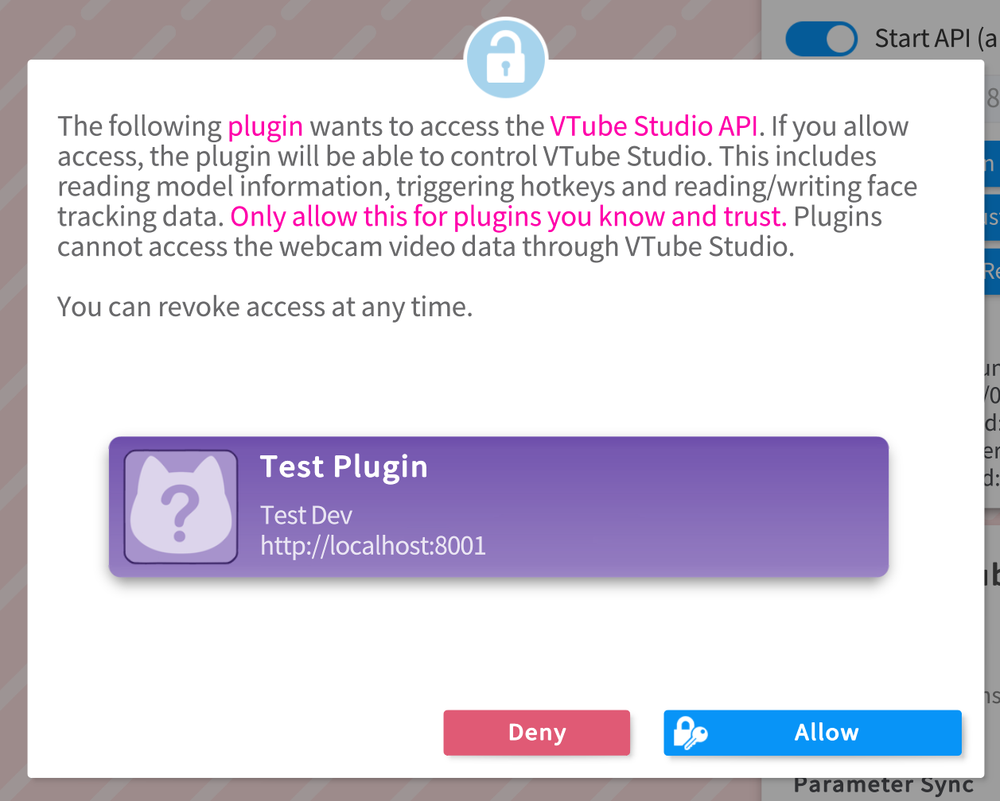

# VTubeStudio Python Wrapper

A high-level Python wrapper for the VTube Studio API, designed for seamless integration into multi-threaded applications.

## Overview
This wrapper provides an easy-to-use interface for interacting with VTube Studio, allowing developers to send and receive API requests efficiently. It holds a similar implementation to [pyvts](https://github.com/Genteki/pyvts), with one key difference: **this wrapper is built to work via threading** rather than asyncio. This makes it well-suited for applications running multiple threads handling CPU/GPU-intensive tasks while still maintaining smooth communication with VTube Studio.

## Features
- Thread-based WebSocket communication
- Easy request-response handling
- Suitable for multi-threaded applications
- Simplified API calls for interacting with VTube Studio

## Installation
### 1. Install VTube Studio
First, you need to install **VTube Studio** from Steam.

### 2. Enable API Connection
1. Open **VTube Studio**.
2. Click anywhere on the main screen **twice** to open the **left-side menu**.
3. Click the **Settings (gear icon)** .
4. Ensure you are in the **General Settings** .
5. Scroll down on the **right-side menu** until you find the **API Connection** option.
6. Turn on the **API Connection** .

### 3. Run `vts_api.py`
Now, you can run `vts_api.py`. On the **first run**, you will not have the plugin connected nor an API key, but this script will set it up for you.

1. Run the script:
   ```sh
   python vts_api.py
   ```
2. The script will make an **authentication request**, which you must **approve within VTube Studio** .
3. After approval:
   - Your plugin will now be **registered** within the API.
   - Your **API key** will be saved in a `.env` file (if it doesn’t exist, it will be created automatically).

### 4. Implementing Further Functionality
To extend the functionality:
- Refer to `vts_requester.py` to see all **available requests**.
- If you need additional requests, follow the existing structure and refer to the **official VTube Studio API documentation**: [DenchiSoft/VTubeStudio](https://github.com/DenchiSoft/VTubeStudio).

## Why Use This Wrapper?
If you’re working on a multi-threaded Python application that needs to communicate with VTube Studio **without the limitations of asyncio**, this wrapper provides an efficient alternative while keeping the API usage simple and intuitive.